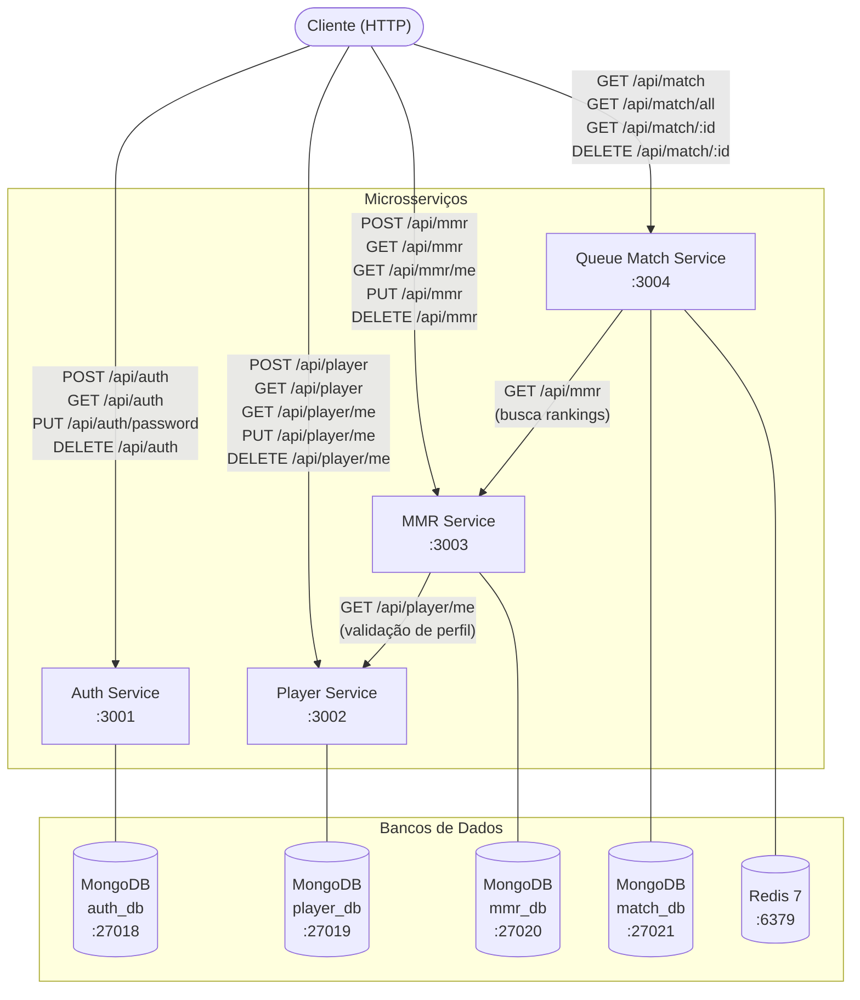
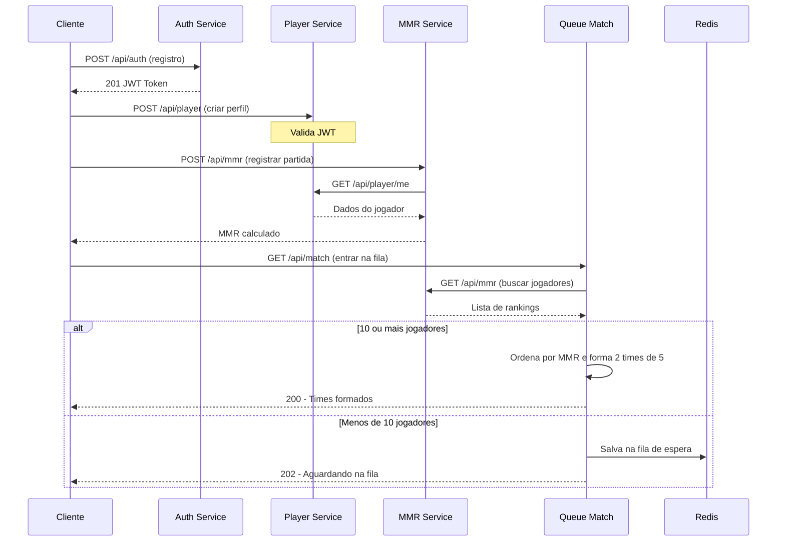

# Valorant MMR System

Sistema de gerenciamento de MMR (Matchmaking Rating) inspirado no Valorant, construído com arquitetura de microsserviços. Desenvolvido como exercício acadêmico para a disciplina de Desenvolvimento de Software para Web I.

## Visão Geral

O sistema é composto por quatro microsserviços independentes que se comunicam entre si para gerenciar autenticação, perfis de jogadores, cálculo de MMR e matchmaking.

## Arquitetura



### Fluxo de Matchmaking



## Serviços

| Serviço | Porta | Banco de Dados | Responsabilidade |
|---------|-------|----------------|-----------------|
| [Auth Service](./services/auth-service/README.md) | 3001 | MongoDB (auth_db) | Registro, login e geração de JWT |
| [Player Service](./services/player-service/README.md) | 3002 | MongoDB (player_db) | Gestão de perfis de jogador |
| [MMR Service](./services/mmr-service/README.md) | 3003 | MongoDB (mmr_db) | Histórico de partidas e cálculo de MMR |
| [Queue Match Service](./services/queue-match/README.md) | 3004 | MongoDB (match_db) + Redis | Fila de matchmaking e formação de times |

## Tecnologias

- **Runtime:** Node.js 20 + TypeScript
- **Framework:** Express 5
- **Bancos de Dados:** MongoDB (via Mongoose) + Redis 7
- **Autenticação:** JWT (jsonwebtoken) + Bcrypt
- **Documentação:** Swagger UI (OpenAPI 3)
- **Logging:** Winston
- **Containerização:** Docker + Docker Compose

## Pré-requisitos

- [Docker](https://www.docker.com/) e Docker Compose
- Git

## Como Executar

### 1. Clonar o repositório

```bash
git clone <url-do-repositorio>
cd valorant-mmr-system
```

### 2. Configurar variáveis de ambiente

```bash
cp .env-example .env
```

Edite o `.env` com suas credenciais (veja a seção de [configuração](#variáveis-de-ambiente)).

### 3. Subir os containers

```bash
docker-compose up -d
```

### 4. Verificar os serviços

```bash
docker-compose ps
```

Todos os serviços devem estar com status `healthy`.

### 5. Acessar a documentação Swagger

| Serviço | URL |
|---------|-----|
| Auth | http://localhost:3001/api-docs |
| Player | http://localhost:3002/api-docs |
| MMR | http://localhost:3003/api-docs |
| Queue Match | http://localhost:3004/api-docs |

## Variáveis de Ambiente

```env
LOG_LEVEL=debug
NODE_ENV=development

# JWT
JWT_SECRET=troque_em_producao

# Redis
REDIS_HOST=localhost
REDIS_PORT=6379
REDIS_PASSWORD=senha_redis

# MongoDB URIs
AUTH_DB_URI=mongodb://mongo-auth:27017/auth_db
PLAYER_DB_URI=mongodb://mongo-player:27017/player_db
MMR_DB_URI=mongodb://mongo-mmr:27017/mmr_db
MATCH_DB_URI=mongodb://mongo-match:27017/match_db

# Portas dos serviços
AUTH_PORT=3001
PLAYER_PORT=3002
MMR_PORT=3003
MMR_MATCH=3004
```

## Estrutura do Projeto

```
valorant-mmr-system/
├── docker-compose.yml        # Orquestração dos containers
├── .env-example              # Template de variáveis de ambiente
├── .env                      # Variáveis de ambiente (não commitado)
└── services/
    ├── auth-service/         # Autenticação e JWT
    ├── player-service/       # Perfis de jogador
    ├── mmr-service/          # Cálculo de MMR e ranking
    └── queue-match/          # Matchmaking
```

## Fluxo de Uso Recomendado

1. **Registrar** usuário via `POST /api/auth`
2. **Fazer login** via `POST /api/auth/login` e guardar o JWT
3. **Criar perfil** de jogador via `POST /api/player` (header `Authorization: Bearer <token>`)
4. **Registrar partidas** e calcular MMR via `POST /api/mmr`
5. **Entrar na fila** de matchmaking via `GET /api/match`
6. Com 10+ jogadores, os times são formados automaticamente por MMR

## Parar os Containers

```bash
# Apenas parar
docker-compose down

# Parar e remover volumes (apaga todos os dados)
docker-compose down -v
```
