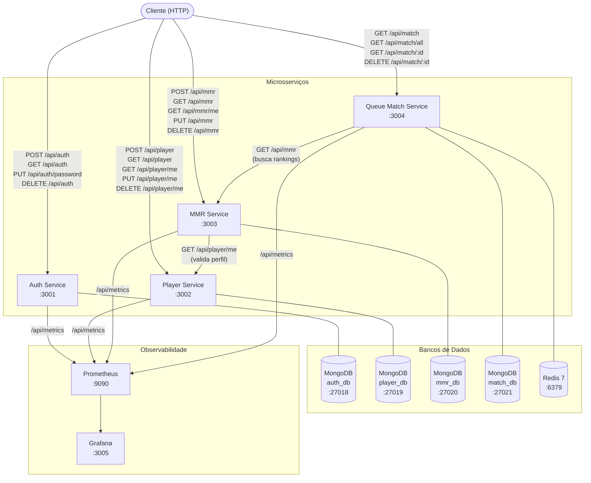
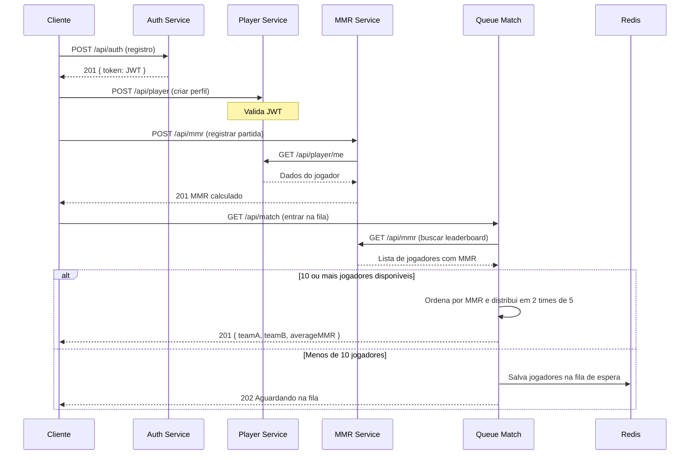
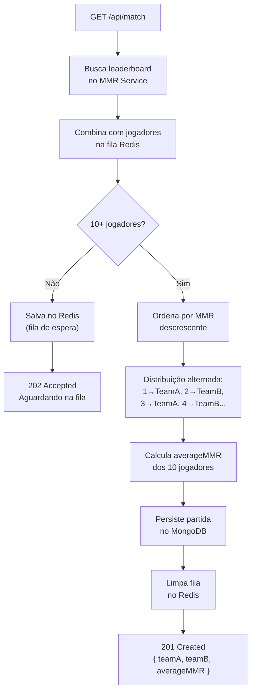

<div align="center">

# Valorant MMR System

Sistema de gerenciamento de **MMR (Matchmaking Rating)** inspirado no Valorant, construído com arquitetura de microsserviços independentes, cada um com seu próprio banco de dados, API REST documentada e stack observável via Prometheus + Grafana.


*Projeto acadêmico — Disciplina: Desenvolvimento de Software para Web I*

</div>

---

## Sumário

- [Visão Geral](#visão-geral)
- [Arquitetura](#arquitetura)
- [Microsserviços](#microsserviços)
- [Tecnologias](#tecnologias)
- [Pré-requisitos](#pré-requisitos)
- [Instalação e Execução](#instalação-e-execução)
- [Variáveis de Ambiente](#variáveis-de-ambiente)
- [API Reference](#api-reference)
- [Sistema de Ranking e MMR](#sistema-de-ranking-e-mmr)
- [Algoritmo de Matchmaking](#algoritmo-de-matchmaking)
- [Fluxo de Uso Completo](#fluxo-de-uso-completo)
- [Observabilidade](#observabilidade)
- [Testes de Carga](#testes-de-carga)
- [Estrutura do Projeto](#estrutura-do-projeto)
- [Desenvolvimento Local sem Docker](#desenvolvimento-local-sem-docker)
- [Parar os Serviços](#parar-os-serviços)

---

## Visão Geral

O sistema replica a lógica central de um jogo competitivo online: jogadores se registram, criam perfis com rank e agente, acumulam histórico de partidas que alimentam um cálculo de MMR, e entram numa fila de matchmaking que forma times equilibrados automaticamente.

**Decisões de design:**
- Cada microsserviço possui seu próprio banco MongoDB isolado — sem banco compartilhado
- Comunicação entre serviços via HTTP REST (sem message broker)
- Fila de matchmaking persistida no Redis para sobreviver a restarts
- JWT gerado pelo Auth Service e validado localmente em cada serviço
- Métricas Prometheus expostas em `/api/metrics` em todos os serviços

---

## Arquitetura

### Diagrama de Componentes



### Fluxo de Matchmaking



---

## Microsserviços

### Auth Service — Porta `3001`

Responsável por registro, autenticação e gestão de credenciais. Emite o JWT usado por todos os outros serviços para validar identidade.

| Responsabilidade | Detalhe |
|---|---|
| Registro | Hash de senha com bcrypt (salt rounds configurável) |
| Login | Valida credenciais e retorna JWT assinado |
| Validação | Middleware `tokenIsValid` reutilizável pelos outros serviços |
| CRUD | Alteração de senha e deleção de conta autenticadas |

**Modelo de dados:**

```ts
{
  email: string       // único, indexado
  password: string    // hash bcrypt, nunca exposto
  createdAt: Date
  updatedAt: Date
}
```

---

### Player Service — Porta `3002`

Gerencia perfis de jogador. Cada usuário autenticado pode ter exatamente um perfil com rank, agente principal e região.

| Responsabilidade | Detalhe |
|---|---|
| Perfil | Criação e atualização de nickname, rank, agente e região |
| Listagem | Endpoint público para listar todos os jogadores |
| Seed | Script `npm run seed` popula o banco com jogadores de teste |

**Modelo de dados:**

```ts
{
  email: string       // referência ao Auth Service (via JWT)
  nickname: string
  rank: number        // 1–25 (ver tabela de ranks)
  agent: number       // 0–28 (ver lista de agentes)
  region: string      // "Américas" | "Europa" | "Ásia-Pacífico"
  createdAt: Date
  updatedAt: Date
}
```

---

### MMR Service — Porta `3003`

Registra histórico de partidas, calcula o MMR de cada jogador e expõe o leaderboard público.

| Responsabilidade | Detalhe |
|---|---|
| Histórico | Persiste kills, deaths e resultado de cada partida |
| Cálculo | Fórmula baseada em K/D ratio, rank e resultado |
| Leaderboard | Ranking global ordenado por MMR |
| Integração | Consulta Player Service para validar perfil antes de registrar |

**Modelo de dados:**

```ts
{
  email: string
  mmr: number
  matchHistory: Array<{
    kill: number
    death: number
    result: string    // "VITÓRIA" | "Derrota"
  }>
  createdAt: Date
  updatedAt: Date
}
```

---

### Queue Match Service — Porta `3004`

Fila de matchmaking com persistência no Redis. Forma times de 5v5 equilibrados por MMR usando a lista do MMR Service.

| Responsabilidade | Detalhe |
|---|---|
| Fila | Armazena jogadores no Redis enquanto aguardam 10 participantes |
| Matchmaking | Consulta leaderboard do MMR Service e distribui por MMR |
| Times | Distribuição alternada (1→A, 2→B, 3→A...) para equilíbrio |
| Partidas | Persiste as partidas formadas no MongoDB |

**Modelo de dados:**

```ts
{
  teamA: Array<{ email: string, mmr: number }>
  teamB: Array<{ email: string, mmr: number }>
  averageMMR: number
  createdAt: Date
}
```

---

## Tecnologias

### Runtime e Framework

| Tecnologia | Versão | Uso |
|---|---|---|
| Node.js | 20 (Alpine) | Runtime de todos os serviços |
| TypeScript | ^6.0 | Tipagem estática, compilado para `dist/` |
| Express | ^5.2 | Framework HTTP (versão 5 com async error handling nativo) |
| tsx | ^4.21 | Execução de TypeScript em desenvolvimento sem compilação |
| nodemon | ^3.1 | Hot-reload em desenvolvimento |

### Bancos de Dados

| Tecnologia | Versão | Uso |
|---|---|---|
| MongoDB | 7 | Banco principal de cada serviço (4 instâncias isoladas) |
| Mongoose | ^9.6 | ODM para MongoDB com tipagem TypeScript |
| Redis | 7-alpine | Fila de matchmaking persistente no Queue Match |
| ioredis / redis | ^5.12 | Cliente Redis para Node.js |

### Autenticação e Segurança

| Tecnologia | Versão | Uso |
|---|---|---|
| jsonwebtoken | ^9.0 | Geração e validação de JWT |
| bcrypt | ^6.0 | Hash de senhas com salt |
| cors | ^2.8 | Controle de CORS nas APIs |

### Documentação e Observabilidade

| Tecnologia | Versão | Uso |
|---|---|---|
| swagger-jsdoc | ^6.2 | Geração de spec OpenAPI 3.0 a partir de JSDoc |
| swagger-ui-express | ^5.0 | UI interativa em `/api-docs` |
| prom-client | ^15.1 | Métricas Prometheus em `/api/metrics` |
| Prometheus | — | Coleta de métricas de todos os serviços |
| Grafana | — | Dashboards de observabilidade |
| Winston | ^3.19 | Logging estruturado com níveis configuráveis |

### Infraestrutura

| Tecnologia | Uso |
|---|---|
| Docker | Containerização de todos os serviços |
| Docker Compose | Orquestração do stack completo com health checks |
| dotenv | ^17 | Gerenciamento de variáveis de ambiente |

---

## Pré-requisitos

- [Docker](https://www.docker.com/get-started) 24+ e Docker Compose v2
- Git

> Para desenvolvimento local sem Docker, veja a seção [Desenvolvimento Local sem Docker](#desenvolvimento-local-sem-docker).

---

## Instalação e Execução

### 1. Clonar o repositório

```bash
git clone <url-do-repositorio>
cd valorant-mmr-system
```

### 2. Configurar variáveis de ambiente

```bash
cp .env-example .env
```

Edite o `.env` com suas credenciais. Veja a seção [Variáveis de Ambiente](#variáveis-de-ambiente) para descrição completa de cada variável.

### 3. Subir os containers

```bash
docker compose up -d
```

Este comando sobe **11 containers** em ordem correta:

```
mongo-auth   → auth-service
mongo-player → player-service
mongo-mmr  ┐
player-service ┘ → mmr-service
mongo-match ┐
redis       ┤
mmr-service ┘ → queue-match
              prometheus → grafana
```

### 4. Verificar saúde dos serviços

```bash
docker compose ps
```

Todos os serviços devem estar com status `healthy` ou `running`.

```bash
# Logs em tempo real de todos os serviços
docker compose logs -f

# Logs de um serviço específico
docker compose logs -f auth-service
```

### 5. Acessar as APIs

| Serviço | API Base | Swagger UI |
|---|---|---|
| Auth Service | http://localhost:3001/api | http://localhost:3001/api-docs |
| Player Service | http://localhost:3002/api | http://localhost:3002/api-docs |
| MMR Service | http://localhost:3003/api | http://localhost:3003/api-docs |
| Queue Match | http://localhost:3004/api | http://localhost:3004/api-docs |
| Prometheus | http://localhost:9090 | — |
| Grafana | http://localhost:3005 | — |

### 6. Popular dados de teste (opcional)

```bash
docker compose exec player-service npm run seed
```

---

## Variáveis de Ambiente

Copie `.env-example` para `.env` e preencha:

```env
# ─── Logger ───────────────────────────────────────────────────────────
LOG_LEVEL=debug          # debug | info | warn | error
NODE_ENV=development     # development | production

# ─── Redis ────────────────────────────────────────────────────────────
REDIS_PASS=sua_senha_redis
REDIS_HOST=redis         # nome do container (ou localhost em dev local)
REDIS_PORT=6379

# ─── Auth Service ─────────────────────────────────────────────────────
AUTH_PORT=3001
AUTH_MONGO_URI=mongodb://mongo-auth:27017/auth_db
JWT_SECRET=troque_em_producao   # ⚠️ use um segredo forte em produção

# ─── Player Service ───────────────────────────────────────────────────
PLAYER_PORT=3002
PLAYER_MONGO_URI=mongodb://mongo-player:27017/player_db

# ─── MMR Service ──────────────────────────────────────────────────────
MMR_PORT=3003
MMR_MONGO_URI=mongodb://mongo-mmr:27017/mmr_db

# ─── Queue Match Service ──────────────────────────────────────────────
MATCH_PORT=3004
MATCH_MONGO_URI=mongodb://mongo-match:27017/match_db
```

> **Nota:** No Docker Compose os hosts dos bancos e serviços usam o nome do container (ex: `mongo-auth`, `redis`). Em desenvolvimento local, substitua por `localhost`.

---

## API Reference

> Todas as rotas protegidas requerem o header: `Authorization: Bearer <token>`

### Auth Service

#### `POST /api/auth` — Registrar usuário

```bash
curl -X POST http://localhost:3001/api/auth \
  -H "Content-Type: application/json" \
  -d '{ "email": "jogador@exemplo.com", "password": "senha123" }'
```

```json
// 201 Created
{ "token": "eyJhbGci..." }
```

---

#### `POST /api/auth/login` — Login

```bash
curl -X POST http://localhost:3001/api/auth/login \
  -H "Content-Type: application/json" \
  -d '{ "email": "jogador@exemplo.com", "password": "senha123" }'
```

```json
// 200 OK
{ "token": "eyJhbGci..." }
```

---

#### `GET /api/auth` — Listar usuários `🔒`

```bash
curl http://localhost:3001/api/auth \
  -H "Authorization: Bearer <token>"
```

---

#### `PUT /api/auth/password` — Alterar senha `🔒`

```bash
curl -X PUT http://localhost:3001/api/auth/password \
  -H "Authorization: Bearer <token>" \
  -H "Content-Type: application/json" \
  -d '{ "currentPassword": "senha123", "newPassword": "novaSenha456" }'
```

---

#### `DELETE /api/auth` — Deletar conta `🔒`

```bash
curl -X DELETE http://localhost:3001/api/auth \
  -H "Authorization: Bearer <token>" \
  -H "Content-Type: application/json" \
  -d '{ "password": "senha123" }'
```

---

### Player Service

#### `POST /api/player` — Criar perfil `🔒`

```bash
curl -X POST http://localhost:3002/api/player \
  -H "Authorization: Bearer <token>" \
  -H "Content-Type: application/json" \
  -d '{
    "nickname": "SentinelBR",
    "rank": 16,
    "agent": 11,
    "region": "Américas"
  }'
```

```json
// 201 Created
{
  "email": "jogador@exemplo.com",
  "nickname": "SentinelBR",
  "rank": 16,
  "agent": 11,
  "region": "Américas"
}
```

> `rank`: índice de 1 a 25 | `agent`: índice de 0 a 28 — ver [tabelas abaixo](#sistema-de-ranking-e-mmr)

---

#### `GET /api/player` — Listar todos os jogadores

```bash
curl http://localhost:3002/api/player
```

---

#### `GET /api/player/me` — Ver próprio perfil `🔒`

```bash
curl http://localhost:3002/api/player/me \
  -H "Authorization: Bearer <token>"
```

---

#### `PUT /api/player/me` — Atualizar perfil `🔒`

```bash
curl -X PUT http://localhost:3002/api/player/me \
  -H "Authorization: Bearer <token>" \
  -H "Content-Type: application/json" \
  -d '{ "rank": 19, "agent": 3 }'
```

---

#### `DELETE /api/player/me` — Deletar perfil `🔒`

```bash
curl -X DELETE http://localhost:3002/api/player/me \
  -H "Authorization: Bearer <token>"
```

---

### MMR Service

#### `POST /api/mmr` — Registrar partidas e calcular MMR `🔒`

```bash
curl -X POST http://localhost:3003/api/mmr \
  -H "Authorization: Bearer <token>" \
  -H "Content-Type: application/json" \
  -d '{
    "matchHistory": [
      { "kill": 22, "death": 8,  "result": "VITÓRIA" },
      { "kill": 15, "death": 12, "result": "Derrota" },
      { "kill": 30, "death": 5,  "result": "VITÓRIA" }
    ]
  }'
```

```json
// 201 Created
{
  "email": "jogador@exemplo.com",
  "mmr": 847,
  "matchHistory": [...]
}
```

---

#### `GET /api/mmr` — Leaderboard público

```bash
curl http://localhost:3003/api/mmr
```

```json
// 200 OK
[
  { "email": "top1@exemplo.com",    "mmr": 1420 },
  { "email": "jogador@exemplo.com", "mmr": 847  },
  ...
]
```

---

#### `GET /api/mmr/me` — Ver próprio MMR e histórico `🔒`

```bash
curl http://localhost:3003/api/mmr/me \
  -H "Authorization: Bearer <token>"
```

---

#### `PUT /api/mmr` — Adicionar partidas ao histórico `🔒`

```bash
curl -X PUT http://localhost:3003/api/mmr \
  -H "Authorization: Bearer <token>" \
  -H "Content-Type: application/json" \
  -d '{
    "matchHistory": [
      { "kill": 18, "death": 10, "result": "VITÓRIA" }
    ]
  }'
```

---

#### `DELETE /api/mmr` — Deletar registro de MMR `🔒`

```bash
curl -X DELETE http://localhost:3003/api/mmr \
  -H "Authorization: Bearer <token>"
```

---

### Queue Match Service

#### `GET /api/match` — Entrar na fila / tentar formar partida

```bash
curl http://localhost:3004/api/match
```

```json
// 201 Created — times formados
{
  "teamA": [
    { "email": "jogador1@ex.com", "mmr": 1420 },
    { "email": "jogador3@ex.com", "mmr": 1380 },
    { "email": "jogador5@ex.com", "mmr": 1350 },
    { "email": "jogador7@ex.com", "mmr": 1290 },
    { "email": "jogador9@ex.com", "mmr": 1210 }
  ],
  "teamB": [
    { "email": "jogador2@ex.com", "mmr": 1400 },
    { "email": "jogador4@ex.com", "mmr": 1360 },
    { "email": "jogador6@ex.com", "mmr": 1320 },
    { "email": "jogador8@ex.com", "mmr": 1250 },
    { "email": "jogador10@ex.com","mmr": 1190 }
  ],
  "averageMMR": 1317
}
```

```json
// 202 Accepted — aguardando jogadores suficientes
{ "message": "Aguardando na fila", "playersInQueue": 4 }
```

---

#### `GET /api/match/all` — Listar todas as partidas

```bash
curl http://localhost:3004/api/match/all
```

---

#### `GET /api/match/:id` — Buscar partida por ID

```bash
curl http://localhost:3004/api/match/64f1a2b3c4d5e6f7a8b9c0d1
```

---

#### `DELETE /api/match/:id` — Deletar partida

```bash
curl -X DELETE http://localhost:3004/api/match/64f1a2b3c4d5e6f7a8b9c0d1
```

---

## Sistema de Ranking e MMR

### Tabela de Ranks

| Índice | Rank | | Índice | Rank |
|---|---|---|---|---|
| 1 | Ferro 1 | | 14 | Platina 2 |
| 2 | Ferro 2 | | 15 | Platina 3 |
| 3 | Ferro 3 | | 16 | Diamante 1 |
| 4 | Bronze 1 | | 17 | Diamante 2 |
| 5 | Bronze 2 | | 18 | Diamante 3 |
| 6 | Bronze 3 | | 19 | Ascendente 1 |
| 7 | Prata 1 | | 20 | Ascendente 2 |
| 8 | Prata 2 | | 21 | Ascendente 3 |
| 9 | Prata 3 | | 22 | Imortal 1 |
| 10 | Ouro 1 | | 23 | Imortal 2 |
| 11 | Ouro 2 | | 24 | Imortal 3 |
| 12 | Ouro 3 | | 25 | Radiante |
| 13 | Platina 1 | | | |

### Lista de Agentes (índice 0–28)

| Idx | Agente | Idx | Agente | Idx | Agente |
|---|---|---|---|---|---|
| 0 | Astra | 10 | Iso | 20 | Sage |
| 1 | Breach | 11 | Jett | 21 | Skye |
| 2 | Brimstone | 12 | KAY/O | 22 | Sova |
| 3 | Chamber | 13 | Killjoy | 23 | Tejo |
| 4 | Clove | 14 | Miks | 24 | Veto |
| 5 | Cypher | 15 | Neon | 25 | Viper |
| 6 | Deadlock | 16 | Omen | 26 | Vyse |
| 7 | Fade | 17 | Phoenix | 27 | Waylay |
| 8 | Gekko | 18 | Raze | 28 | Yoru |
| 9 | Harbor | 19 | Reyna | | |

### Cálculo de MMR

O MMR é calculado com base no rank do jogador, no K/D ratio da última partida e no resultado:

```
rankScore        = rank × 100
matchScore       = round(kills / deaths) + rankScore
winModifier      = +1  (se resultado = "VITÓRIA")
                   -1  (caso contrário)
MMR              = round((matchScore + winModifier) / 3)
```

**Exemplo:** Jogador Diamante 1 (rank 16), 22 kills, 8 deaths, vitória

```
rankScore   = 16 × 100 = 1600
matchScore  = round(22/8) + 1600 = 3 + 1600 = 1603
winModifier = +1
MMR         = round((1603 + 1) / 3) = round(534.67) = 535
```

---

## Algoritmo de Matchmaking



A distribuição alternada garante que os times recebam jogadores de MMR similar — o melhor jogador vai para TeamA, o segundo melhor para TeamB, e assim alternadamente — resultando em times com MMR médio praticamente idêntico.

---

## Fluxo de Uso Completo

Exemplo end-to-end com curl. Salve o token retornado no passo 2 e use nos passos seguintes.

```bash
# 1. Registrar usuário
curl -X POST http://localhost:3001/api/auth \
  -H "Content-Type: application/json" \
  -d '{"email":"meu@email.com","password":"senha123"}'

# 2. Login → guarde o token
TOKEN=$(curl -s -X POST http://localhost:3001/api/auth/login \
  -H "Content-Type: application/json" \
  -d '{"email":"meu@email.com","password":"senha123"}' | jq -r .token)

# 3. Criar perfil de jogador
curl -X POST http://localhost:3002/api/player \
  -H "Authorization: Bearer $TOKEN" \
  -H "Content-Type: application/json" \
  -d '{"nickname":"ProPlayer","rank":19,"agent":11,"region":"Américas"}'

# 4. Registrar partidas e calcular MMR
curl -X POST http://localhost:3003/api/mmr \
  -H "Authorization: Bearer $TOKEN" \
  -H "Content-Type: application/json" \
  -d '{
    "matchHistory": [
      {"kill":25,"death":7,"result":"VITÓRIA"},
      {"kill":18,"death":10,"result":"Derrota"},
      {"kill":30,"death":4,"result":"VITÓRIA"}
    ]
  }'

# 5. Ver leaderboard
curl http://localhost:3003/api/mmr

# 6. Entrar na fila de matchmaking
curl http://localhost:3004/api/match

# 7. Ver todas as partidas formadas
curl http://localhost:3004/api/match/all
```

---

## Observabilidade

O stack de observabilidade sobe automaticamente com o `docker compose up`:

| Serviço | URL | Credenciais padrão |
|---|---|---|
| Prometheus | http://localhost:9090 | — |
| Grafana | http://localhost:3005 | admin / admin |

### Métricas disponíveis

Cada microsserviço expõe `/api/metrics` com métricas padrão do Node.js via `prom-client`:

- `http_request_duration_seconds` — latência por rota e status code
- `http_requests_total` — total de requisições
- `nodejs_heap_size_used_bytes` — uso de memória
- `process_cpu_seconds_total` — uso de CPU
- `nodejs_active_handles_total` — handles ativos

### Configuração do Prometheus

As targets são definidas em `observability/prometheus.yml`. Para adicionar um novo serviço ao scraping, adicione uma entrada em `scrape_configs`.

---

## Testes de Carga

O projeto possui testes de performance para todos os 4 serviços com 4 ferramentas diferentes: **k6**, **Artillery**, **Locust** e **JMeter**.

> Documentação completa em [load-tests/README.md](./load-tests/README.md)

**Pré-requisito:** serviços rodando via `docker compose up -d`

### Execução rápida

```bash
# k6 — smoke test (1 usuário, 30s)
k6 run load-tests/k6/auth-service.test.js

# k6 — fluxo completo com carga normal
k6 run -e TEST_SCENARIO=load load-tests/k6/full-flow.test.js

# Artillery
artillery run load-tests/artillery/auth-service.yml

# Locust — UI interativa em http://localhost:8089
locust -f load-tests/locust/auth_service.py
```

### Cenários k6

| `TEST_SCENARIO` | VUs | Duração | Objetivo |
|---|---|---|---|
| `smoke` (padrão) | 1 | 30s | Verificar funcionamento básico |
| `load` | Até 20 | ~5min | Simular carga normal |
| `stress` | Até 200 | ~11min | Encontrar o ponto de ruptura |
| `spike` | Pico de 300 | ~2min | Testar resiliência a picos súbitos |

### Thresholds de qualidade

| Métrica | Aceitável | Crítico |
|---|---|---|
| Tempo de resposta p(95) | < 1000ms | > 2000ms |
| Tempo de resposta p(99) | < 2000ms | > 4000ms |
| Taxa de erros | < 5% | > 10% |

---

## Estrutura do Projeto

```
valorant-mmr-system/
│
├── docker-compose.yml            # Orquestração de todos os containers
├── .env-example                  # Template de variáveis de ambiente
│
├── observability/
│   └── prometheus.yml            # Configuração de scraping do Prometheus
│
├── load-tests/                   # Testes de carga e performance
│   ├── README.md                 # Documentação completa dos testes
│   ├── k6/                       # Testes JavaScript com k6
│   ├── artillery/                # Testes YAML com Artillery
│   ├── locust/                   # Testes Python com Locust
│   └── jmeter/                   # Testes XML com JMeter
│
└── services/
    ├── auth-service/
    │   ├── Dockerfile
    │   ├── package.json
    │   ├── tsconfig.json
    │   └── src/
    │       ├── app.ts            # Bootstrap da aplicação
    │       ├── server/           # Configuração Express e Swagger
    │       ├── routes/           # Definição de rotas + anotações OpenAPI
    │       ├── controllers/      # Handlers HTTP
    │       ├── services/         # Lógica de negócio
    │       ├── repositories/     # Acesso ao banco de dados
    │       ├── models/           # Schemas Mongoose
    │       ├── middlewares/      # Auth JWT + logger de endpoint
    │       ├── config/           # Conexão com banco
    │       └── utils/            # Logger Winston
    │
    ├── player-service/           # Mesma estrutura + scripts/seed.ts
    ├── mmr-service/              # Mesma estrutura + lib/player-service/api.ts
    └── queue-match/              # Mesma estrutura + config/redis.ts
                                  #                 + lib/mmr-service/api.ts
                                  #                 + services/queue.service.ts
```

Todos os serviços seguem a mesma arquitetura em camadas: **routes → controllers → services → repositories → models**.

---

## Desenvolvimento Local sem Docker

Para rodar um serviço individualmente sem Docker (requer MongoDB e Redis instalados localmente):

```bash
# Instalar dependências
cd services/auth-service
npm install

# Configurar .env local apontando para localhost
AUTH_MONGO_URI=mongodb://localhost:27017/auth_db
JWT_SECRET=dev_secret
AUTH_PORT=3001

# Iniciar em modo desenvolvimento (hot-reload)
npm run dev

# Build de produção
npm run build
npm start
```

> **Player Service** tem um script extra de seed:
> ```bash
> npm run seed   # popula o banco com jogadores de teste
> ```

---

## Parar os Serviços

```bash
# Parar os containers (mantém volumes e dados)
docker compose down

# Parar e remover todos os volumes (apaga todos os dados)
docker compose down -v

# Remover também as imagens buildadas
docker compose down -v --rmi local
```

---

<div align="center">

Feito como exercício acadêmico para a disciplina de **Desenvolvimento de Software para Web I**.

</div>
