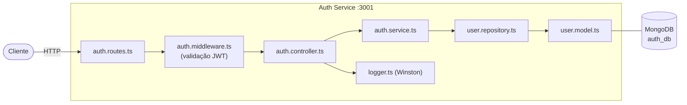

# Auth Service

Microsserviço responsável pelo registro de usuários, autenticação e emissão de tokens JWT no sistema Valorant MMR.

## Responsabilidades

- Registro de novos usuários com senha criptografada (bcrypt)
- Autenticação e geração de tokens JWT
- Validação de tokens para outros serviços via middleware
- CRUD de contas de usuário

## Arquitetura Interna



## Endpoints

| Método | Rota | Autenticação | Descrição |
|--------|------|:---:|-----------|
| `POST` | `/api/auth` | Não | Registrar novo usuário |
| `POST` | `/api/auth/login` | Não | Login e obtenção do JWT |
| `GET` | `/api/auth` | Sim | Listar todos os usuários |
| `PUT` | `/api/auth/password` | Sim | Atualizar senha |
| `DELETE` | `/api/auth` | Sim | Deletar conta |

### Exemplos de Requisição

**Registro**
```http
POST /api/auth
Content-Type: application/json

{
  "email": "jogador@email.com",
  "password": "minhasenha123"
}
```

**Login**
```http
POST /api/auth/login
Content-Type: application/json

{
  "email": "jogador@email.com",
  "password": "minhasenha123"
}
```

**Resposta do Login**
```json
{
  "token": "eyJhbGciOiJIUzI1NiIsInR5cCI6IkpXVCJ9..."
}
```

**Rotas autenticadas** — incluir o header:
```http
Authorization: Bearer <token>
```

## Modelo de Dados

```typescript
// user.model.ts
{
  email: string;      // único, obrigatório
  password: string;   // hash bcrypt
  createdAt: Date;
  updatedAt: Date;
}
```

## Variáveis de Ambiente

| Variável | Descrição | Exemplo |
|----------|-----------|---------|
| `AUTH_DB_URI` | URI de conexão MongoDB | `mongodb://mongo-auth:27017/auth_db` |
| `JWT_SECRET` | Chave secreta do JWT | `troque_em_producao` |
| `AUTH_PORT` | Porta do serviço | `3001` |
| `LOG_LEVEL` | Nível de log (Winston) | `debug` |

## Executar Localmente

```bash
cd services/auth-service

# Instalar dependências
npm install

# Modo desenvolvimento (hot reload)
npm run dev

# Build de produção
npm run build
npm start
```

## Documentação da API

Swagger UI disponível em: http://localhost:3001/api-docs

## Tecnologias

- Express 5
- Mongoose (MongoDB)
- jsonwebtoken
- bcrypt
- Winston (logging)
- Swagger UI
