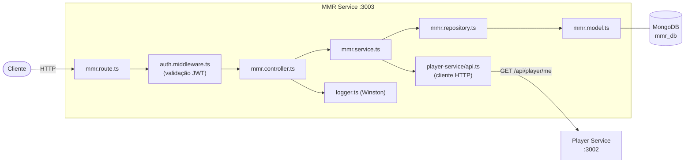

# MMR Service

Microsserviço responsável pelo registro de histórico de partidas, cálculo do MMR (Matchmaking Rating) e exposição do leaderboard global.

## Responsabilidades

- Registro de partidas e cálculo automático de MMR
- Armazenamento do histórico de partidas de cada jogador
- Exposição do leaderboard ordenado por MMR
- Comunicação com o Player Service para validação de perfil

## Arquitetura Interna



## Endpoints

| Método | Rota | Autenticação | Descrição |
|--------|------|:---:|-----------|
| `POST` | `/api/mmr` | Sim | Registrar partida e calcular MMR |
| `GET` | `/api/mmr` | Não | Listar leaderboard global |
| `GET` | `/api/mmr/me` | Sim | Buscar meu MMR e histórico |
| `PUT` | `/api/mmr` | Sim | Adicionar mais partidas ao histórico |
| `DELETE` | `/api/mmr` | Sim | Deletar registro de MMR |

### Exemplos de Requisição

**Registrar Partida**
```http
POST /api/mmr
Authorization: Bearer <token>
Content-Type: application/json

{
  "kills": 20,
  "deaths": 8,
  "result": "VITÓRIA"
}
```

**Resposta**
```json
{
  "playerId": "abc123",
  "mmr": 87,
  "matchHistory": [
    {
      "kills": 20,
      "deaths": 8,
      "result": "VITÓRIA",
      "score": 89,
      "date": "2024-01-15T10:30:00Z"
    }
  ]
}
```

**Leaderboard**
```http
GET /api/mmr
```

## Fórmula de Cálculo do MMR

```
rankScore  = rank do jogador (1-25)
score      = round(kills / deaths + rankScore)
winRate    = +1 se "VITÓRIA", -1 caso contrário
MMR        = round((lastMatchScore + winRate) / 3)
```

### Exemplo

| Parâmetro | Valor |
|-----------|-------|
| Kills | 20 |
| Deaths | 8 |
| Rank | 15 (Platina 3) |
| Resultado | VITÓRIA |
| Score | round(20/8 + 15) = 17 |
| winRate | +1 |
| MMR | round((17 + 1) / 3) = **6** |

## Modelo de Dados

```typescript
// mmr.model.ts
{
  playerId: string;         // referência ao perfil no Player Service
  mmr: number;              // MMR calculado
  matchHistory: [
    {
      kills: number;
      deaths: number;
      result: string;       // "VITÓRIA" ou outro
      score: number;
      date: Date;
    }
  ];
  createdAt: Date;
  updatedAt: Date;
}
```

## Comunicação Entre Serviços

O MMR Service chama o Player Service ao registrar uma partida para:
- Verificar se o jogador tem perfil criado
- Obter o rank atual do jogador (usado no cálculo do MMR)

```
MMR Service ──GET /api/player/me──> Player Service
```

## Variáveis de Ambiente

| Variável | Descrição | Exemplo |
|----------|-----------|---------|
| `MMR_DB_URI` | URI de conexão MongoDB | `mongodb://mongo-mmr:27017/mmr_db` |
| `JWT_SECRET` | Chave secreta do JWT | `troque_em_producao` |
| `MMR_PORT` | Porta do serviço | `3003` |
| `PLAYER_SERVICE_URL` | URL do Player Service | `http://player-service:3002` |
| `LOG_LEVEL` | Nível de log (Winston) | `debug` |

## Executar Localmente

```bash
cd services/mmr-service

# Instalar dependências
npm install

# Modo desenvolvimento (hot reload)
npm run dev

# Build de produção
npm run build
npm start
```

## Documentação da API

Swagger UI disponível em: http://localhost:3003/api-docs

## Tecnologias

- Express 5
- Mongoose (MongoDB)
- jsonwebtoken (validação)
- Winston (logging)
- Swagger UI
