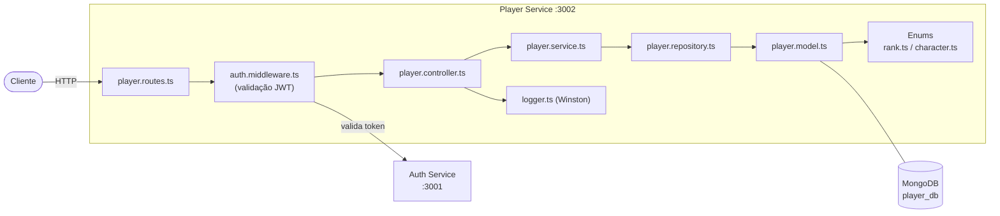

# Player Service

Microsserviço responsável pela gestão de perfis de jogadores, incluindo nickname, rank, agente principal e região.

## Responsabilidades

- CRUD completo de perfis de jogador
- Associação de jogador ao usuário autenticado (via JWT)
- Gestão de rank (25 níveis: Ferro 1 até Radiante)
- Gestão de agentes do Valorant (29 agentes disponíveis)

## Arquitetura Interna



## Endpoints

| Método | Rota | Autenticação | Descrição |
|--------|------|:---:|-----------|
| `POST` | `/api/player` | Sim | Criar perfil de jogador |
| `GET` | `/api/player` | Não | Listar todos os perfis |
| `GET` | `/api/player/me` | Sim | Buscar meu perfil |
| `PUT` | `/api/player/me` | Sim | Atualizar meu perfil |
| `DELETE` | `/api/player/me` | Sim | Deletar meu perfil |

### Exemplos de Requisição

**Criar Perfil**
```http
POST /api/player
Authorization: Bearer <token>
Content-Type: application/json

{
  "nickname": "ProPlayer",
  "rank": 15,
  "character": 11,
  "region": "BR"
}
```

**Buscar todos os perfis**
```http
GET /api/player
```

## Modelo de Dados

```typescript
// player.model.ts
{
  userId: string;     // referência ao usuário do Auth Service
  nickname: string;   // nome no jogo
  rank: number;       // 1-25 (veja tabela de ranks)
  character: number;  // 0-28 (veja lista de agentes)
  region: string;     // região do servidor
  createdAt: Date;
  updatedAt: Date;
}
```

## Sistema de Ranks

| Rank | ID | Rank | ID | Rank | ID |
|------|----|------|----|------|----|
| Ferro 1 | 1 | Platina 1 | 13 | Imortal 1 | 22 |
| Ferro 2 | 2 | Platina 2 | 14 | Imortal 2 | 23 |
| Ferro 3 | 3 | Platina 3 | 15 | Imortal 3 | 24 |
| Bronze 1 | 4 | Diamante 1 | 16 | Radiante | 25 |
| Bronze 2 | 5 | Diamante 2 | 17 | | |
| Bronze 3 | 6 | Diamante 3 | 18 | | |
| Prata 1 | 7 | Ascendente 1 | 19 | | |
| Prata 2 | 8 | Ascendente 2 | 20 | | |
| Prata 3 | 9 | Ascendente 3 | 21 | | |
| Ouro 1 | 10 | | | | |
| Ouro 2 | 11 | | | | |
| Ouro 3 | 12 | | | | |

## Agentes Disponíveis (29)

| Agente | ID | Agente | ID | Agente | ID |
|--------|----|--------|----|--------|----|
| Astra | 0 | Harbor | 10 | Skye | 20 |
| Breach | 1 | Iso | 11 | Sova | 21 |
| Brimstone | 2 | Jett | 12 | Tejo | 22 |
| Chamber | 3 | Kayo | 13 | Veto | 23 |
| Clove | 4 | Killjoy | 14 | Viper | 24 |
| Cypher | 5 | Miks | 15 | Vyse | 25 |
| Deadlock | 6 | Neon | 16 | Waylay | 26 |
| Fade | 7 | Omen | 17 | Yoru | 27 |
| Gekko | 8 | Phoenix | 18 | | |
| | | Raze | 19 | Reyna | 28 |

## Variáveis de Ambiente

| Variável | Descrição | Exemplo |
|----------|-----------|---------|
| `PLAYER_DB_URI` | URI de conexão MongoDB | `mongodb://mongo-player:27017/player_db` |
| `JWT_SECRET` | Chave secreta do JWT (para validação) | `troque_em_producao` |
| `PLAYER_PORT` | Porta do serviço | `3002` |
| `LOG_LEVEL` | Nível de log (Winston) | `debug` |

## Executar Localmente

```bash
cd services/player-service

# Instalar dependências
npm install

# Modo desenvolvimento (hot reload)
npm run dev

# Seed do banco de dados (popular com dados iniciais)
npm run seed

# Build de produção
npm run build
npm start
```

## Documentação da API

Swagger UI disponível em: http://localhost:3002/api-docs

## Tecnologias

- Express 5
- Mongoose (MongoDB)
- jsonwebtoken (validação)
- Winston (logging)
- Swagger UI
