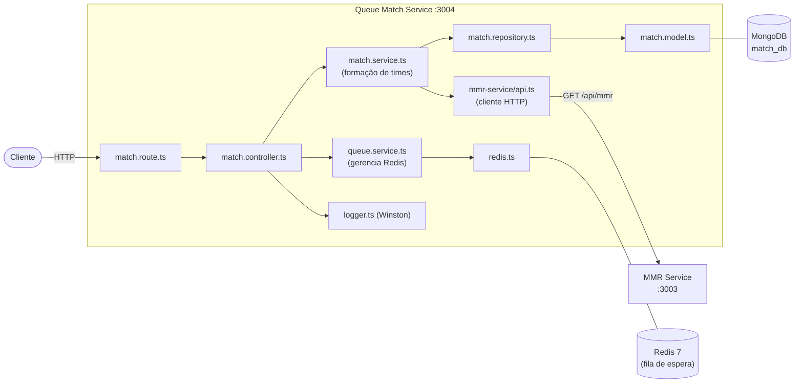
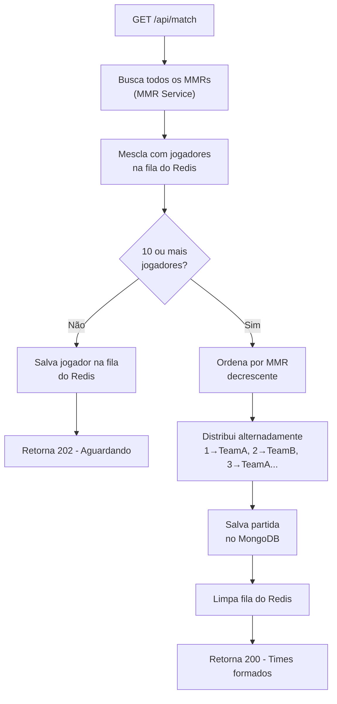

# Queue Match Service

Microsserviço responsável pela fila de matchmaking e formação de times balanceados por MMR.

## Responsabilidades

- Gerenciar a fila de espera de jogadores via Redis
- Buscar rankings no MMR Service para ordenar jogadores
- Formar times de 5 jogadores balanceados por MMR quando há 10+ na fila
- Persistir partidas formadas no MongoDB

## Arquitetura Interna



## Endpoints

| Método | Rota | Autenticação | Descrição |
|--------|------|:---:|-----------|
| `GET` | `/api/match` | Não | Entrar na fila e tentar formar partida |
| `GET` | `/api/match/all` | Não | Listar todas as partidas criadas |
| `GET` | `/api/match/:id` | Não | Buscar partida por ID |
| `DELETE` | `/api/match/:id` | Não | Deletar partida |

### Exemplo de Resposta — Partida Formada

```http
GET /api/match
```

```json
{
  "status": "match_created",
  "match": {
    "_id": "abc123",
    "teamA": [
      { "playerId": "p1", "nickname": "Ace", "mmr": 95 },
      { "playerId": "p3", "nickname": "Flash", "mmr": 88 },
      { "playerId": "p5", "nickname": "Nova", "mmr": 81 },
      { "playerId": "p7", "nickname": "Storm", "mmr": 74 },
      { "playerId": "p9", "nickname": "Echo", "mmr": 67 }
    ],
    "teamB": [
      { "playerId": "p2", "nickname": "Blaze", "mmr": 92 },
      { "playerId": "p4", "nickname": "Vex", "mmr": 85 },
      { "playerId": "p6", "nickname": "Lynx", "mmr": 78 },
      { "playerId": "p8", "nickname": "Riot", "mmr": 71 },
      { "playerId": "p10", "nickname": "Shade", "mmr": 64 }
    ],
    "createdAt": "2024-01-15T10:30:00Z"
  }
}
```

### Exemplo de Resposta — Aguardando na Fila

```json
{
  "status": "queued",
  "message": "Jogador adicionado à fila. Aguardando mais jogadores.",
  "playersInQueue": 7
}
```

## Algoritmo de Matchmaking



### Estratégia de Balanceamento

Os jogadores são ordenados por MMR em ordem decrescente e distribuídos alternadamente entre os dois times:

```
Posição no ranking: 1  2  3  4  5  6  7  8  9  10
Time:              A  B  A  B  A  B  A  B  A   B
```

Isso garante que cada time tenha uma soma de MMR equilibrada.

## Modelo de Dados

```typescript
// match.model.ts
{
  teamA: [
    {
      playerId: string;
      nickname: string;
      mmr: number;
    }
  ];
  teamB: [
    {
      playerId: string;
      nickname: string;
      mmr: number;
    }
  ];
  createdAt: Date;
}
```

## Comunicação Entre Serviços

```
Queue Match ──GET /api/mmr──> MMR Service ──> Retorna leaderboard com MMR de todos os jogadores
```

O serviço usa o leaderboard do MMR Service como fonte de dados para preencher a fila antes de verificar se há jogadores suficientes.

## Variáveis de Ambiente

| Variável | Descrição | Exemplo |
|----------|-----------|---------|
| `MATCH_DB_URI` | URI de conexão MongoDB | `mongodb://mongo-match:27017/match_db` |
| `MMR_MATCH` | Porta do serviço | `3004` |
| `REDIS_HOST` | Host do Redis | `redis` |
| `REDIS_PORT` | Porta do Redis | `6379` |
| `REDIS_PASSWORD` | Senha do Redis | `senha_redis` |
| `MMR_SERVICE_URL` | URL do MMR Service | `http://mmr-service:3003` |
| `LOG_LEVEL` | Nível de log (Winston) | `debug` |

## Executar Localmente

```bash
cd services/queue-match

# Instalar dependências
npm install

# Modo desenvolvimento (hot reload)
npm run dev

# Build de produção
npm run build
npm start
```

> **Atenção:** Para funcionar localmente, é necessário ter o Redis e o MMR Service rodando.
> Use `docker-compose up redis mmr-service -d` antes de rodar este serviço isolado.

## Documentação da API

Swagger UI disponível em: http://localhost:3004/api-docs

## Tecnologias

- Express 5
- Mongoose (MongoDB)
- Redis 7 (fila de espera)
- Winston (logging)
- Swagger UI
